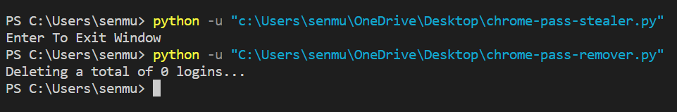

<h1><b> Targetting:- Chrome</b></h1>

#
   

#
<h2> Output : </h2>


#

> chrome-cookie-extractor.py is used to extract all of your cookie data from chrome.
<br>

> chrome-pass-stealer.py is used to steal login details which is saved in your chrome web browser
<br>

> chrome-pass-remover.py is used to remove login details as none can steal those confidencial details using chrome-pass-stealer.py

<h2><b> Git Installation :</h2></b>

```
git clone https://github.com/R3DHULK/targetting-chrome 
cd targetting-chrome
python <which tool you want to run>
```

#
<h1 align="left"><b>Support 👇👇👇 </b></h1>
<a href="https://www.buymeacoffee.com/r3dhulk"> </a><br><br>
